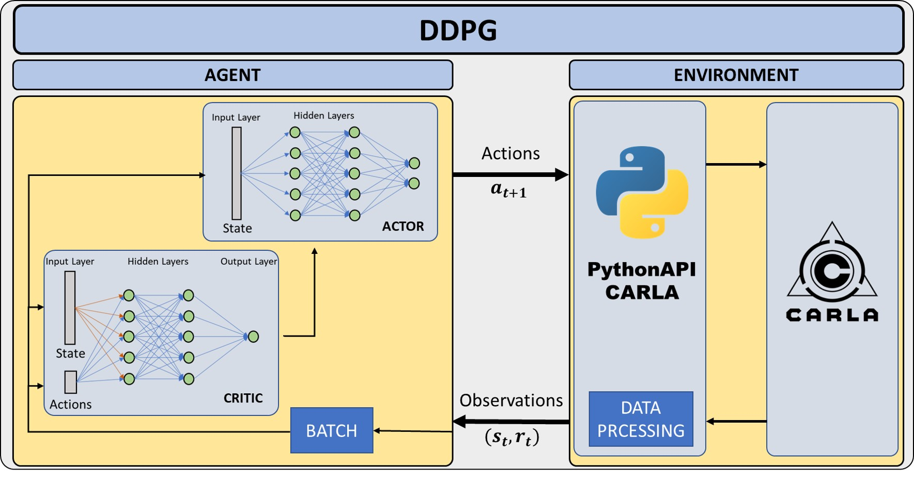
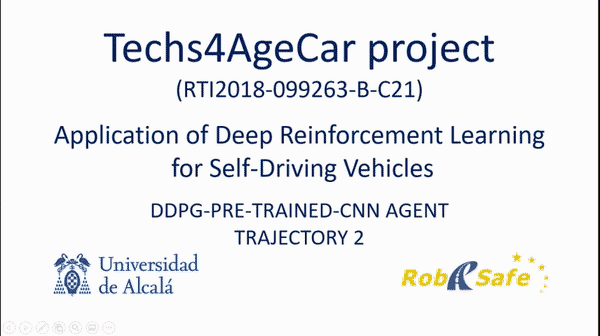
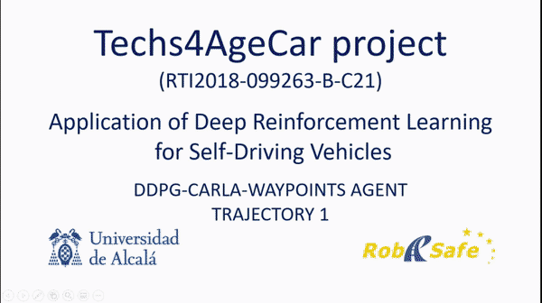

# Deep Deterministic Policy Gradient
Deep Reinforcement Learning based on DDPG using CARLA Simulator for self-driving vehicles.

## Overview
This project uses CARLA Simulator and DQN algorithm to training agents which could predict
the following action to be taken by a self-driving vehicle in terms of control commands.
Several agents are contemplated in the project depending on the input data used to train the
Deep Reinforcement Learning algorithm. 
Both training and validation programs are available in the repository.

## Requirements
- Python3.6
- Numpy
- Tensorflow==1.14.0
- Keras==2.2.4
- OpenCV==4.1.2

This requirements will be installed automatically by using 
```ssh
pip3 install -e requirements.txt"
```

## Get Started and Usage
### config.py
Choose the desire settings in config.py before launch any training or play stage.
Make sure that the paths involve in the program exist, if not, create them to avoid failures in execution.
### DDPG/critc.py & DDP/actor.py
Settings for Neural Networks involve in training process.
### launch_DQN.py
In a terminal make:
```sh
python3 launch_DDPG.py
```
## Results
Each training attempt generates a log file into logs folder where some metrics are saved in order to check how the process is working.


## Video


